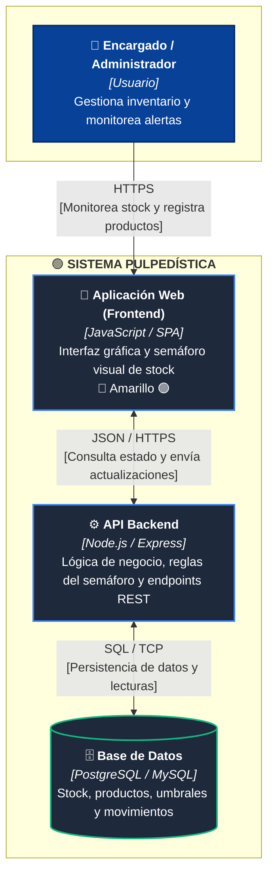

```mermaid
flowchart TD
    classDef person fill:#084298,stroke:#052c65,color:#fff,stroke-width:2px;
    classDef container fill:#1e293b,stroke:#3b82f6,color:#fff,stroke-width:2px;
    classDef db fill:#1e293b,stroke:#10b981,color:#fff,stroke-width:2px;

    subgraph UserSpace [" "]
        U["👤 <b>Encargado / Administrador</b><br/><i>[Usuario]</i><br/>Gestiona inventario y monitorea alertas"]:::person
    end

    subgraph SystemBoundary [" 🟢 <b>SISTEMA PULPEDÍSTICA</b> "]
        direction TB
        
        FE["📱 <b>Aplicación Web (Frontend)</b><br/><i>[JavaScript / SPA]</i><br/>Interfaz gráfica y semáforo visual de stock<br/>🔴 Amarillo 🟢"]:::container
        
        BE["⚙️ <b>API Backend</b><br/><i>[Node.js / Express]</i><br/>Lógica de negocio, reglas del semáforo y endpoints REST"]:::container
        
        DB[("🗄️ <b>Base de Datos</b><br/><i>[PostgreSQL / MySQL]</i><br/>Stock, productos, umbrales y movimientos")]:::db
    end

    U -->|"HTTPS<br/>[Monitorea stock y registra productos]"| FE
    FE <-->|"JSON / HTTPS<br/>[Consulta estado y envía actualizaciones]"| BE
    BE <-->|"SQL / TCP<br/>[Persistencia de datos y lecturas]"| DB
```
