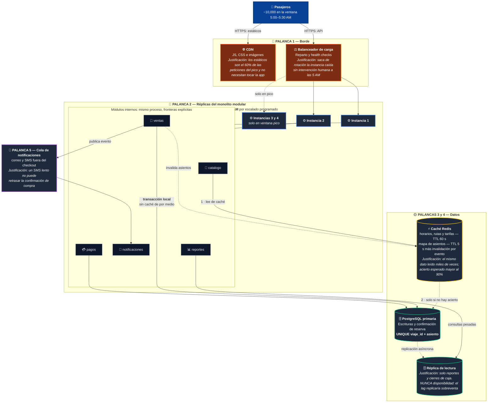
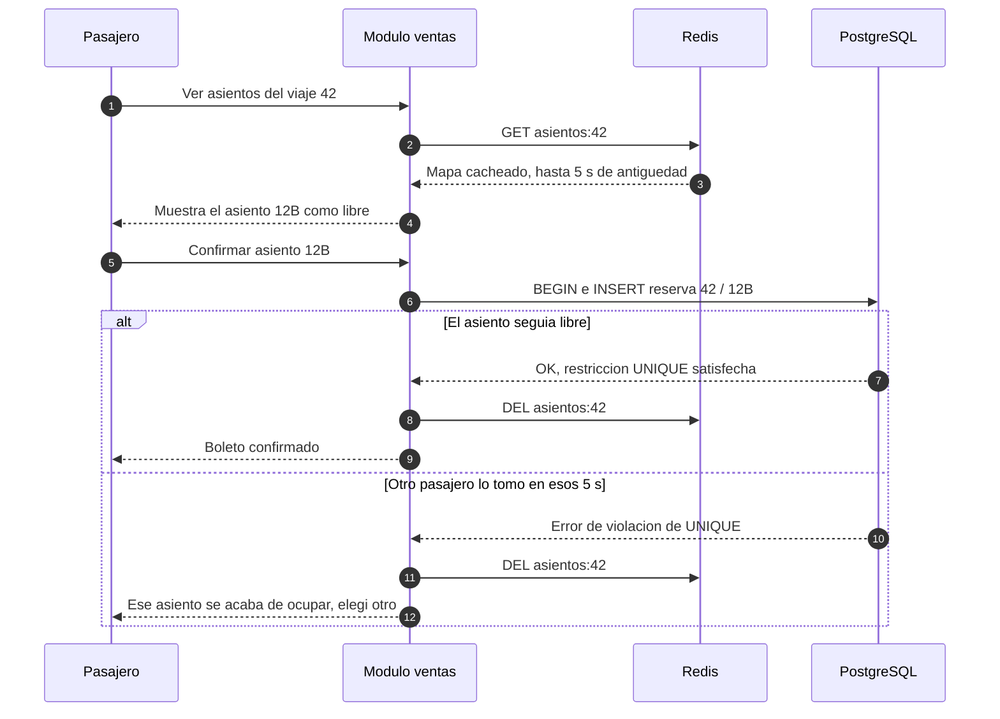

# ADR-001: Arquitectura de la plataforma de venta de boletos (Cooperativa de Buses)

| Campo | Valor |
|---|---|
| **Estado** | Aceptada |
| **Fecha** | 2026-09-07 |
| **Decisores** | Equipo de desarrollo (4 personas), Gerencia de la cooperativa |
| **Sistema** | Plataforma de venta de boletos — Capstone SE1 |
| **Revisión programada** | 12 meses, o al dispararse un *trigger* de la sección 6 |

---

## 1. Contexto

La cooperativa creció de un piloto a **50,000 usuarios registrados**. La operación real tiene tres hechos que mandan sobre cualquier preferencia tecnológica:

1. **Pico diario concentrado a las 5:00 AM.** La venta no está distribuida: se abre la ventana de compra de los viajes del día y la demanda colapsa en ~30 minutos. Estimación con los números que tenemos: si el 20% de los usuarios compra en el pico, son ~10,000 sesiones en 30 min ≈ **6 compras/segundo promedio, ~20/s en la cresta**. Con una relación lectura:escritura observada de ~10:1, hablamos de **~200 lecturas/segundo**. Eso es carga *modesta* para un proceso bien hecho; lo difícil no es el volumen, es la **forma** del pico.
2. **La carga es lectura repetida de los mismos datos.** Miles de usuarios consultan simultáneamente el *mismo* puñado de recursos: horarios del día, rutas, tarifas y el mapa de asientos de 20–40 viajes. Es un problema de **caché**, no de partición de dominio.
3. **El equipo son 4 personas, sin equipo de plataforma.** No hay SRE, no hay guardia formal, no hay presupuesto para observabilidad distribuida. Nadie se levanta a las 4:45 AM a mirar tableros.

### 1.1 Atributos de calidad priorizados

| # | Atributo | Escenario concreto | Por qué esta prioridad |
|---|---|---|---|
| 1 | **Disponibilidad en ventana crítica** | 5:00–5:30 AM, ≥99.9% de las peticiones responden; una caída de 10 min en esa ventana equivale a perder la venta del día completo | Fuera del pico, una caída de 10 min casi no se nota. Toda la disponibilidad que importa está concentrada en 30 minutos |
| 2 | **Consistencia transaccional de la reserva** | Un asiento nunca se vende dos veces, ni siquiera con 20 compras concurrentes sobre el mismo viaje | Una sobreventa cuesta reputación, reembolso y un pasajero de pie a las 6 AM. Es un requisito de negocio, no técnico |
| 3 | **Rendimiento de lectura** | Consulta de horarios y mapa de asientos: p95 < 300 ms bajo carga de pico | Es el 90% del tráfico y lo primero que el usuario percibe |
| 4 | **Modificabilidad con equipo pequeño** | Un cambio en las reglas de tarifa se implementa, prueba y despliega en menos de 1 día por 1 persona | El costo dominante del proyecto es tiempo de desarrollo, no infraestructura |
| 5 | **Costo de operación** | Infraestructura por debajo de $200/mes fuera del pico | Es una cooperativa, no una startup con capital de riesgo |

### 1.2 Atributos explícitamente NO priorizados

Decir qué *no* optimizamos es la mitad de una decisión honesta:

- **Escalabilidad organizacional** (equipos desplegando de forma independiente). Ley de Conway: con **un solo equipo de 4 personas** no hay fronteras organizacionales que reflejar en la arquitectura. Este es el atributo que microservicios resuelve, y es justamente el que no tenemos.
- **Escalabilidad heterogénea por servicio.** Ningún módulo tiene un perfil de carga tan distinto como para justificar escalarlo por separado hoy.
- **Independencia tecnológica / poliglota.** Un solo stack es una ventaja con 4 personas, no una limitación.
- **Escala global / multi-región.** Los pasajeros están en un país y compran en una sola franja horaria.

### 1.3 La presión externa

Gerencia solicitó "microservicios". La solicitud es legítima como preocupación (*"¿aguantará el sistema el crecimiento?"*), pero la solución propuesta no se deriva de nuestros atributos de calidad. Este ADR existe para **evaluar la opción en serio y dejar por escrito el razonamiento**, no para descartarla por reflejo.

---

## 2. Opciones consideradas

### Opción 0 — Statu quo: monolito acoplado actual *(línea base)*

El sistema hoy: un solo despliegue, sin fronteras internas, lógica de negocio mezclada con acceso a datos y con la vista, una sola instancia, sin caché.

| Pros | Contras |
|---|---|
| Costo de migración cero | **No sobrevive el pico**: una sola instancia, sin caché; la base recibe la misma consulta 200 veces por segundo |
| El equipo ya lo conoce | Sin fronteras internas, cada cambio de tarifas toca código de reportes |
| — | Un despliegue fallido a las 4:55 AM no tiene reversa rápida |

**Veredicto:** descartada. Falla el atributo #1, que es el que motiva este ADR. Sirve como línea base contra la cual se miden las demás.

---

### Opción A — Monolito modular + palancas de escala

Un solo artefacto desplegable, internamente dividido en módulos con fronteras explícitas (`catalogo`, `ventas`, `pagos`, `notificaciones`, `reportes`), comunicados por interfaces y sin acceso cruzado a las tablas de otro módulo. Escalado horizontal por réplicas del proceso completo, caché de lecturas y cola para el trabajo diferido.

| Pros para *este* caso | Contras para *este* caso |
|---|---|
| **Ataca el problema real**: la lectura repetida se resuelve con caché, sin meter red entre servicios | **Escalado grueso**: para escalar ventas se replica también reportes y catálogo. Con 3 instancias el desperdicio es trivial; con 30 dejaría de serlo |
| **La reserva es una transacción local de base de datos.** `UNIQUE(viaje_id, asiento)` más una transacción resuelven la sobreventa con una línea de esquema | **Sin despliegue independiente**: un arreglo en los correos obliga a redesplegar ventas |
| Escala horizontal real: el proceso es *stateless*, se pone detrás de un balanceador y se replica para el pico | **Radio de impacto compartido**: una fuga de memoria en reportes tumba la venta |
| Un pipeline, un runtime, un log, una alerta. Operable por 4 personas | Las fronteras entre módulos son **convención, no barrera física**: se degradan si nadie las vigila |
| Costo bajo y predecible | Un solo stack tecnológico para todo |
| **Reversible**: los módulos con fronteras limpias son los mejores candidatos a extraerse después | — |

---

### Opción B — Microservicios

Descomponer en servicios desplegables por separado: `catalogo`, `ventas`, `pagos`, `notificaciones`, `reportes`, con bases de datos propias, API gateway y comunicación por red.

| Pros para *este* caso | Contras para *este* caso |
|---|---|
| Se escalaría solo `ventas` durante el pico | **La reserva se vuelve una transacción distribuida.** Reservar asiento + cobrar + emitir boleto cruza tres servicios: hay que implementar una *saga* con compensaciones. Se cambia un `UNIQUE` de una línea por una máquina de estados con sus propios modos de falla. Ataca de frente el atributo #2 |
| Aislamiento de fallas entre servicios | **Ley de Conway al revés**: 5 servicios para 4 personas significa que cada quien mantiene más de un servicio. Se pagan todos los costos de la distribución sin obtener el beneficio, que es la autonomía entre equipos |
| Permitiría stacks distintos por servicio | **Latencia peor, no mejor**: una consulta de horarios que hoy es un `JOIN` local se convierte en 2–3 saltos de red. Empeora el atributo #3 |
| Escalaría a millones de usuarios | **Disponibilidad peor**: con 5 servicios en cadena a 99.9% cada uno, el compuesto ronda 99.5%. Más piezas y más fallas justo en la ventana donde menos lo podemos permitir |
| — | **Costo operativo**: 5 pipelines, 5 repositorios, *service discovery*, trazas distribuidas, versionado de contratos. Sin equipo de plataforma, ese trabajo sale del tiempo de features |
| — | Depurar un fallo a las 5 AM exige correlacionar trazas entre servicios |

**Nota para gerencia:** microservicios es la respuesta correcta a la pregunta *"¿cómo hago que 8 equipos desplieguen sin bloquearse entre sí?"*. Nuestra pregunta es *"¿cómo sirvo la misma consulta 200 veces por segundo durante 30 minutos?"*. Son problemas distintos, y la respuesta a la segunda es una caché.

---

### Opción C — Serverless (FaaS + servicios gestionados)

Funciones bajo demanda detrás de un API gateway, con base de datos gestionada y facturación por invocación.

| Pros para *este* caso | Contras para *este* caso |
|---|---|
| **Encaja con la forma del pico**: escala de 0 a N y se paga solo lo consumido. Es el modelo de costo más alineado con "23.5 horas de calma y 30 minutos de furia" | **Arranques en frío justo en la cresta.** El pico es un salto casi vertical: el escalado dispara docenas de contenedores fríos a las 5:00:00 AM, exactamente cuando el p95 más importa |
| Cero administración de servidores | **Agotamiento de conexiones a la base**: cientos de funciones concurrentes contra una base relacional exigen un *pooler* intermedio. La complejidad no desaparece, se muda de lugar |
| Alta disponibilidad gestionada por el proveedor | **Transacciones repartidas entre funciones**: el mismo problema de consistencia de la Opción B, con menos control |
| — | **Amarre al proveedor** fuerte y difícil de revertir en un proyecto académico que debe seguir siendo portable |
| — | El equipo no tiene experiencia; se depura con logs remotos y sin un entorno local fiel |
| — | La facturación por invocación es difícil de presupuestar para una cooperativa que necesita un número fijo |

---

## 3. Decisión

> **Adoptamos la Opción A: monolito modular desplegado en instancias *stateless* detrás de un balanceador, con caché de lecturas, réplica de lectura para reportes y cola asíncrona para notificaciones.**

La justificación, atributo por atributo:

| Atributo priorizado | Cómo lo resuelve la decisión |
|---|---|
| **#1 Disponibilidad en el pico** | 2 instancias en operación normal y escalado **programado a 4 instancias entre 4:30 y 6:30 AM** (programado, no reactivo: el escalado reactivo llega tarde a un pico vertical). El balanceador saca de rotación la instancia que falle su *health check* |
| **#2 Consistencia de la reserva** | La confirmación es una **transacción local** contra PostgreSQL con `UNIQUE(viaje_id, asiento)`. Sin saga, sin compensaciones, sin estados intermedios. La caché **nunca** decide si un asiento se vende |
| **#3 Rendimiento de lectura** | Caché Redis sobre horarios, rutas y tarifas: datos que cambian pocas veces al día y se leen miles de veces. Se espera **más de 90% de aciertos**, con lo que la base deja de ver el pico de lectura |
| **#4 Modificabilidad** | Un repositorio, un pipeline, un despliegue. Los módulos internos evitan que el monolito modular degenere en la Opción 0 |
| **#5 Costo** | 2 instancias pequeñas, un Redis y una réplica: predecible y dentro del presupuesto |

**El criterio que decide:** nuestro cuello de botella es **lectura repetida de datos casi estáticos en una ventana de 30 minutos**, no la coordinación entre equipos ni la heterogeneidad de dominios. Microservicios resuelve un problema organizacional que no tenemos y empeora dos atributos que sí priorizamos (consistencia y latencia). Elegimos monolito modular **porque nuestro problema es de caché, no de organización de equipos**.

### 3.1 Diagrama de la decisión y palancas de escala

**Palancas descartadas por no estar justificadas hoy:** *sharding* de base de datos (una primaria absorbe 20 escrituras por segundo sin despeinarse), Kafka (una cola gestionada simple basta para notificaciones), *service mesh* (no hay malla que gobernar), multi-región (un solo país y una sola franja horaria) y colas entre módulos internos (son llamadas en proceso, no hace falta red).

### 3.2 Por qué la caché no compromete la consistencia

Este es el único punto delicado de la decisión: mostramos disponibilidad cacheada, pero **vendemos contra la base de datos**.

La caché puede mentir sobre lo que *se ve*; la base de datos es la única autoridad sobre lo que *se vende*. El costo aceptado es una fricción ocasional de experiencia de usuario en el pico, nunca una sobreventa.

---

## 4. Consecuencias

### 4.1 Lo que ganamos

- La reserva es una transacción ACID local: **la sobreventa es imposible por esquema**, no por disciplina de código.
- La base deja de ver el pico de lectura: con más de 90% de aciertos, ~200 lecturas por segundo se convierten en ~20.
- Una sola unidad de despliegue, un log y un pipeline: operable por 4 personas sin turnos de guardia.
- Depuración local completa: cualquiera reproduce el flujo de compra entero en su máquina.
- Costo predecible y bajo.

### 4.2 Lo que aceptamos perder *(esta es la parte que se paga)*

| Renuncia | Impacto real | Mitigación |
|---|---|---|
| **Despliegue independiente** | Cambiar el texto de un correo obliga a redesplegar ventas y pagos | Pipeline de menos de 10 minutos, despliegue *rolling* sin caída y **congelamiento de despliegues entre 4:00 y 7:00 AM** |
| **Aislamiento de fallas** | Una fuga de memoria en reportes puede tumbar la venta | *Bulkheads* internos: pool de conexiones separado y límite de concurrencia para reportes, más *timeouts* estrictos por módulo |
| **Escalado selectivo** | Se replica todo el monolito aunque solo ventas lo necesite | Con 2 a 4 instancias el desperdicio cuesta menos que operar 5 servicios. Deja de ser cierto por encima de unas 10 instancias |
| **Libertad tecnológica** | Un solo lenguaje y runtime para todo | Con 4 personas es una ventaja; se reevalúa si el equipo crece |
| **Frescura del dato mostrado** | Un asiento puede aparecer libre hasta 5 s después de venderse | Verificación transaccional al confirmar (sección 3.2) y mensaje de error explícito. **Costo asumido conscientemente** |
| **Entrega inmediata de notificaciones** | El correo del boleto puede llegar segundos, u ocasionalmente minutos, después | El boleto es visible en pantalla al instante; consumidor idempotente y reintentos con *backoff* |
| **Techo de crecimiento** | Esta arquitectura no llega a millones de usuarios sin cambios | Es deliberado: optimizamos para los 50,000 usuarios reales, no para un crecimiento hipotético |
| **Erosión de las fronteras internas** | Sin vigilancia, el monolito modular degenera en la Opción 0 | Prueba de arquitectura en CI que falla si un módulo importa el interior de otro, más revisión de dependencias en cada PR |

### 4.3 Deuda técnica aceptada explícitamente

Aceptamos que **si algún día necesitamos microservicios, la migración costará más que si hubiéramos empezado así**. Lo aceptamos porque: (a) la probabilidad de necesitarlos en 24 meses es baja; (b) el costo de operarlos hoy es cierto e inmediato, mientras que el costo de migrar es futuro e incierto; y (c) unos módulos con fronteras limpias son precisamente el mejor punto de partida para una extracción posterior. Optimizamos para el problema que tenemos, dejando abierta la puerta al que quizá tengamos.

---

## 5. Qué le respondemos a gerencia

No es "no"; es "todavía no, y estas son las condiciones que lo convertirían en un sí":

1. La preocupación real —*"¿aguantamos el crecimiento?"*— queda atendida: con caché y réplicas hay margen para **5 a 10 veces el tráfico actual** sin cambiar de arquitectura.
2. Microservicios resolvería un problema que hoy no tenemos (coordinar muchos equipos) y empeoraría dos que sí tenemos (consistencia de la reserva y latencia de lectura).
3. La decisión **no es irreversible**: los módulos ya están separados. El día que se cumpla un *trigger*, se extrae el módulo afectado y solo ese.

---

## 6. Condiciones que revertirían esta decisión (*triggers* de revisión)

Revisamos este ADR si ocurre cualquiera de estas, **medida y no intuida**:

- El equipo supera **3 equipos independientes** y los despliegues empiezan a bloquearse entre sí, lo que justificaría extraer por frontera de equipo.
- Un módulo necesita **más de 10 instancias** mientras el resto necesita 2, lo que justificaría extraer ese módulo.
- El pico supera **200 escrituras por segundo** sostenidas y la primaria de PostgreSQL se satura, lo que llevaría a evaluar particionado antes que descomponer en servicios.
- Un módulo requiere un stack incompatible, por ejemplo cómputo intensivo de optimización de rutas, lo que justificaría extraer ese servicio y solo ese.
- El tiempo de CI supera los **20 minutos** y frena el ritmo de entrega, lo que llevaría a dividir el pipeline antes que dividir el sistema.

---

## 7. Referencias

- Bass, Clements y Kazman, *Software Architecture in Practice*: escenarios de atributos de calidad.
- Fowler, *MonolithFirst* y *Presumptive Architecture*.
- Newman, *Building Microservices*: los prerrequisitos organizacionales que aquí no se cumplen.
- Práctica 6 de este repositorio: [modelo C4 del sistema](../practica-6/arquitectura.md).
