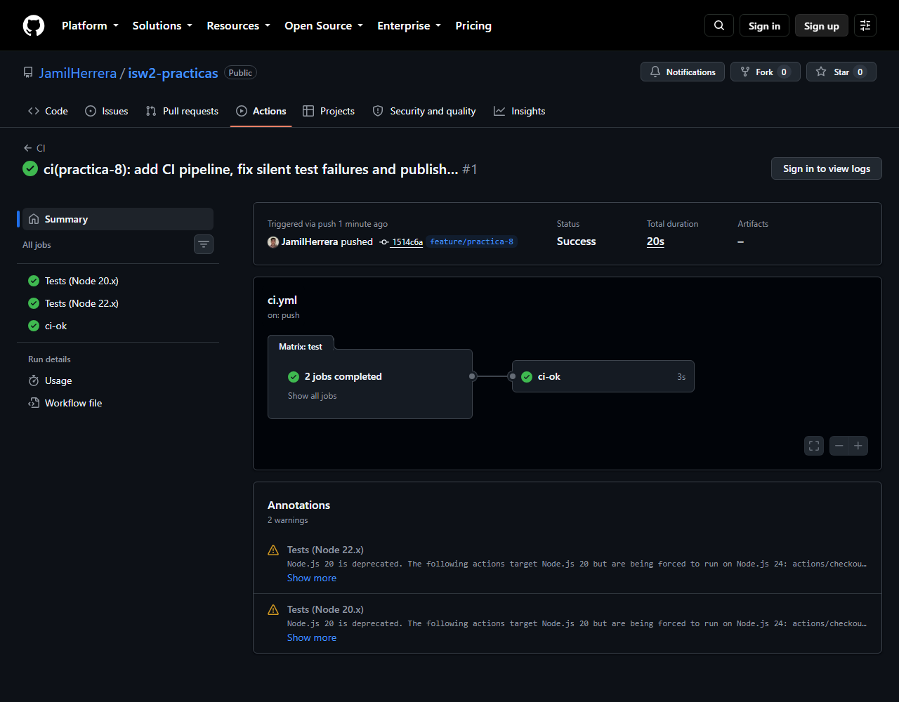

# Práctica 8 · Pipeline verde + URL viva

| Recurso | Enlace |
|---|---|
| **URL pública** | https://jamilherrera.github.io/isw2-practicas/ |
| **Pipeline (Actions)** | [Workflow CI](https://github.com/JamilHerrera/isw2-practicas/actions/workflows/ci.yml) |
| **Definición del workflow** | [`.github/workflows/ci.yml`](../.github/workflows/ci.yml) |
| **Estado actual** |  |

---

## 1. El run verde



Primera corrida del workflow, disparada por el push a `feature/practica-8`:
**Success en 20 segundos**, tres jobs en verde (`Tests (Node 20.x)`,
`Tests (Node 22.x)` y `ci-ok`).

---

## 2. El hallazgo que hacía falta arreglar antes de encender el pipeline

Antes de conectar nada a CI audité los tests de las prácticas 4 y 5, y
encontré un problema que habría vuelto inútil todo el ejercicio.

El *runner* casero de ambas suites atrapaba el fallo, imprimía la línea roja
y **seguía adelante sin marcar el proceso como fallido**:

```js
function test(nombre, fn) {
  try {
    fn();
    console.log(`✅ PASS: ${nombre}`);
  } catch (e) {
    console.error(`❌ FAIL: ${nombre}`);   // se ve rojo...
    console.error(`   ${e.message}`);       // ...pero el proceso sale con 0
  }
}
```

Lo comprobé inyectando un bug real en `calcularMora` (cambiar `0.05` por
`0.99`):

```
❌ FAIL: Calcular mora con días vencidos (> 0)
   Esperado: 50, pero se obtuvo: 990
>>> EXIT CODE CON UN BUG REAL: 0
```

**Exit code 0 con un test fallando.** GitHub Actions decide verde o rojo
únicamente por el código de salida del proceso, así que este pipeline habría
sido verde para siempre, sin importar qué se rompiera. Y con *branch
protection* encima habría sido peor que no tener nada: un candado que siempre
dice que sí, dando confianza falsa.

El arreglo es de tres líneas por suite: contar los fallos y marcar la salida.

```js
  } catch (e) {
    fallaron++;
    console.error(`❌ FAIL: ${nombre}`);
    console.error(`   ${e.message}`);
    // El código de salida ES el contrato con CI.
    process.exitCode = 1;
  }
```

Verificado en los dos sentidos, que es lo que vuelve confiable a un pipeline:

| Escenario | Salida esperada | Resultado |
|---|---|---|
| Todo sano | exit 0 → verde | ✅ `2 de 2 suites pasaron` |
| Bug inyectado en `calcularMora` | exit 1 → rojo | ✅ `1 de 2 suites fallaron (exit 1)` |

Un pipeline que no puede ponerse rojo no es un pipeline, es un adorno.

---

## 3. Segunda iteración: depurar el propio pipeline

La primera corrida fue verde, pero traía **2 warnings** que sí importan:

```
Node.js 20 is deprecated. The following actions target Node.js 20 but are
being forced to run on Node.js 24: actions/checkout@v4, actions/setup-node@v4
```

No rompía hoy, pero es deuda con fecha de vencimiento: cuando los runners
retiren ese runtime, el pipeline falla solo. Subí ambas acciones a `@v5` y
aproveché para alinear la matriz con lo que declara `package.json`
(`engines: >=20`), probando en Node 20.x, 22.x y 24.x. Si decimos que
soportamos desde Node 20, hay que probarlo en Node 20.

---

## 4. Qué corre el pipeline (las 5 líneas)

1. **Cuándo:** en cada push a cualquier rama, en cada PR hacia `main` y a mano
   desde Actions; con `concurrency` que cancela corridas viejas de la misma rama.
2. **Dónde:** matriz de Node 20.x, 22.x y 24.x sobre `ubuntu-latest`, con
   `fail-fast: false` para ver si un fallo es de todas las versiones o de una sola.
3. **Qué valida:** primero `node --check` sobre todos los `.js` como chequeo
   estático barato, y después `npm test`, que corre las suites de las prácticas
   4 y 5 mediante un agregador que reporta *todas* las suites en una sola
   corrida en vez de cortarse en la primera que falla.
4. **Cómo se exige:** un job puente `ci-ok` resume la matriz en un único nombre
   de check estable, que es el que pide *branch protection* en `main`. Sin él
   habría que exigir cada celda de la matriz por separado, y al cambiar una
   versión de Node la protección quedaría esperando un check que ya no existe.
5. **Qué agregaría después:** **lint** (ESLint + Prettier con `--max-warnings 0`,
   lo más barato y lo que más fricción quita en los PR), luego **cobertura** con
   `c8` y un umbral mínimo que falle el build, después **E2E** con Playwright
   cuando el proyecto tenga interfaz real, y por último **CodeQL** y **Dependabot**
   para seguridad. El orden no es por moda: lint da la mejor relación
   señal/esfuerzo, y E2E solo tiene sentido cuando hay una UI que romper.

---

## 5. Cambios que trajo esta práctica al repositorio

| Archivo | Qué hace |
|---|---|
| [`.github/workflows/ci.yml`](../.github/workflows/ci.yml) | Definición del pipeline |
| [`scripts/test-all.js`](../scripts/test-all.js) | Agrega ambas suites y devuelve un único código de salida |
| [`package.json`](../package.json) | Expone `npm test` como puerta de entrada única, local y en CI |
| [`index.html`](../index.html) | Índice de prácticas publicado en GitHub Pages |
| `practica-4/fiados.test.js` · `practica-5/enfermo.test.js` | Runners que ahora sí fallan |
| [`README.md`](../README.md) | Índice completo, badge de CI y URL del sitio |
| `.gitignore` · `.nojekyll` | Higiene del repo y publicación sin Jekyll |

---

## 6. Branch protection

`main` exige el check **`ci-ok`** en verde antes de permitir el merge. Desde
ahora el repositorio se defiende solo: un PR que rompa los tests de la práctica
4 o 5 queda bloqueado sin que nadie tenga que acordarse de revisarlo.
